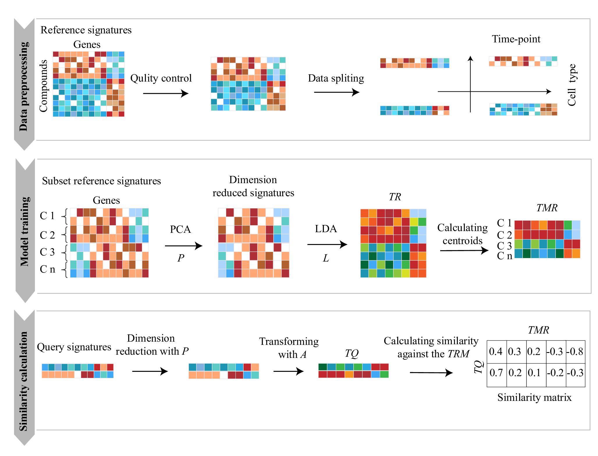

# **DrSim: Similarity learning for transcriptional phenotypic drug discovery**  
## Introduction
DrSim is a learning-based framework that automatically infers similarity measurement for drug discovery from transcriptional perturbation data. Traditionally, such similarity measurements have been defined in an unsupervised way, but due to the high dimensionality and the existence of high noise in thses high-throughput data, they lack robustness with limited performance. We have evaluated DrSim on publicly available in vitro and in vivo datasets in drug annotation and repositioning. The results indicated that DrSim significantly outperforms the existing methods, and is proven to be a conceptual improvement by learning transcriptional similarity to facilitate the broad utility of high-throughput transcriptional perturbation data for phenotypic drug discovery.

## Dependencies
#### Required Software:
* [sklearn](https://scikit-learn.org/stable/index.html/)
* [numpy](https://numpy.org/)
* [pandas](https://pandas.pydata.org/)
* [scipy](https://www.scipy.org/)   

## Installation
#### Install via docker, highly recommended
Docker image of DrSim is available at https://hub.docker.com/r/bm2lab/drsim/.
if you have docker installed, you call pull the image:  

    docker pull bm2lab/drsim

#### Install from github   

    git clone https://github.com/bm2-lab/DrSim.git  
    
## Usage
DrSim can be applied for:  
**Drug annotation:**    

    python  DrugAno.py --help
    python  DrugAno.py  -ref  DrugAnoRef.h5   -query  query.tsv
    
**Drug repositioning**    

    python  DrugRep.py  --help
    python  DrugRep.py   -ref  DrugRepRef.h5  -query  query.tsv
    
## User Manual
For detailed information about usage, data preparation, input, output files and example files, please refer to the [DrSim User Manual](/doc/DrSim_User_Manual.md). The reference signatures in LINCS are available at [onedrive](https://tongjieducn-my.sharepoint.com/:f:/g/personal/1810546_tongji_edu_cn/EilBAh48yfNCmgXZGu1kF5AB845goXLHllwhg1Q8d9akjg?e=pusKSM). The example query signatures generated in TCGA in vivo data are available at [onedrive](https://tongjieducn-my.sharepoint.com/:f:/g/personal/1810546_tongji_edu_cn/EsGz1_ulnkBOr4KIW3RIw04BNkB01ShvpfL5aNnosFrfCw?e=hJi0N9).
 
## DrSim flowchart
<!-- -->
### **DrSim** comprises three steps: data preprocessing, model training and similarity calculation
* **(i)** In the first step, only signatures treated by compounds for 6H or 24H in the nine human cancer cell lines are retained and the retained signatures are split into subsets according to the cell type and time point attributes. 
*  **(ii)** In the second step, DrSim automatically infers a similarity measurement used for query assignment based on the training reference signatures. First, PCA is applied to the reference signatures to denoise and reduce dimensionality. A transformation matrix P is obtained. Second, by applying LDA to the dimensionality-reduced signatures, a transformation matrix L is learned based on the signature labels indicating similarities and dissimilarities between signatures. The label of a signature is the compound that induced the signature. Finally, the transformed references denoted as TR belonging to the identical compound are median centered to derive the transformed median centered references (denoted as TMR). The transformed references TR is calculated using Eq. 1. C denotes the compounds. 
*  **(iii)** In the third step, given a query signature, after transformation by P and L, its similarities to TMR are calculated by cosine similarity (Eq. 3).
 

## Citation:
Similarity learning for transcriptional phenotypic drug discovery, submitted, 2021.

## Contact
Zhiting Wei 1632738@tongji.edu.cn  
Qi Liu qiliu@tongji.edu.cn  
Tongji University, Shanghai, China
    
    
    
    
    
    
    
    
    
    
    
    
    
    
    
    
    
    

